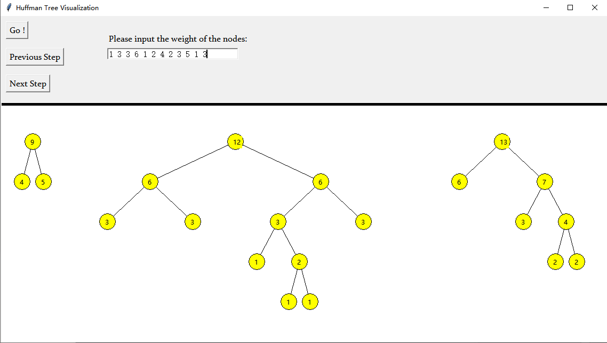

# Huffman-Tree-Visualization
哈夫曼树可视化 Huffman Tree Visualization

A tiny software visualizing how Huffman coding is generated, written in Python plus C++:

- Special arrangement of node posistions for better visualization effect.
- Include an interactive interface that shows the dynamic process. 
- Use C++ for low-level calculations. 

使用 Python和 C++ 开发，动态展示哈夫曼编码的产生过程

- 合理安排节点位置，使得节点间的位置展示不冲突
- 使用 tkinter实现友好的交互界面，动态展示哈夫曼森林的变化
- 底层使用C++实现，包括各步骤中各节点的位置等

可视化时保证节点不冲突的方法：

哈弗曼树的本质属于一种二叉树。考虑一棵满二叉树，最密集的节点分布在 其叶子节点一层。每一层节点个数成二的幂次递增。为了树形保证在任何情况下不会出现节点冲突，只需保证满二叉树最下层节点间距即可。

纵坐标直接使用简单的深度×单位长度，而横坐标通过维护哈弗曼树双亲节点的坐标和每一层的步长即可得到。如哈夫曼树深度为 n，则根节点横坐标为  $ 2^{n-1} $ ,第一层步长为 $ 2^n $  。 每层步长减少一倍，直至叶子节点步长为 1。 

